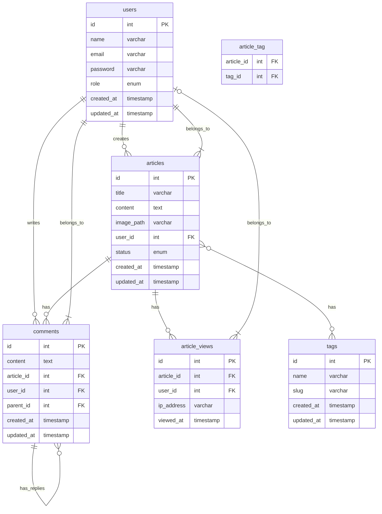

## Тестовые данные (seeds)

### Users
1. Admin user:
   - name: "Admin User"
   - email: "admin@example.com"
   - role: "admin"

2. Regular user:
   - name: "Test User"
   - email: "user@example.com"
   - role: "user"

### Tags
1. Технологии (slug: technologies)
2. Новости (slug: news)
3. Туториалы (slug: tutorials)
4. Разработка (slug: development)

### Articles
1. Тестовая статья:
   - title: "Введение в Laravel"
   - user_id: 1 (admin)
   - status: "published"
   - tags: ["Технологии", "Туториалы"]

2. Черновик статьи:
   - title: "Работа с Docker"
   - user_id: 1 (admin)
   - status: "draft"
   - tags: ["Разработка", "Туториалы"]

### Comments
1. Родительский комментарий:
   - content: "Отличная статья!"
   - user_id: 2
   - article_id: 1

2. Ответ на комментарий:
   - content: "Спасибо за отзыв!"
   - user_id: 1
   - article_id: 1
   - parent_id: 1

### Article Views
Несколько тестовых просмотров с разными временными метками для тестирования статистики:
- Анонимные просмотры (ip_address: "127.0.0.1")
- Авторизованные просмотры (user_id: 2) 